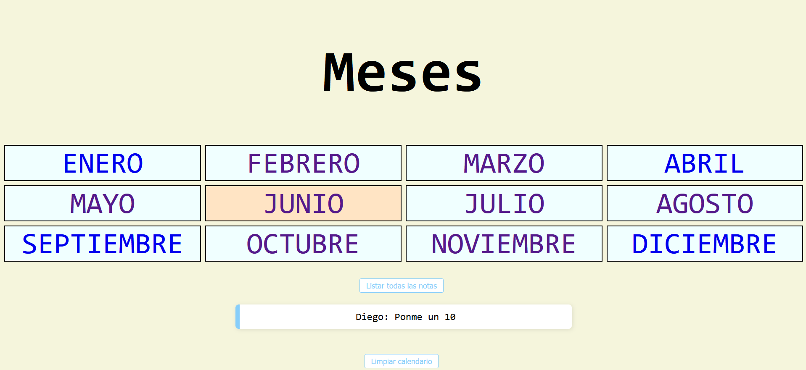
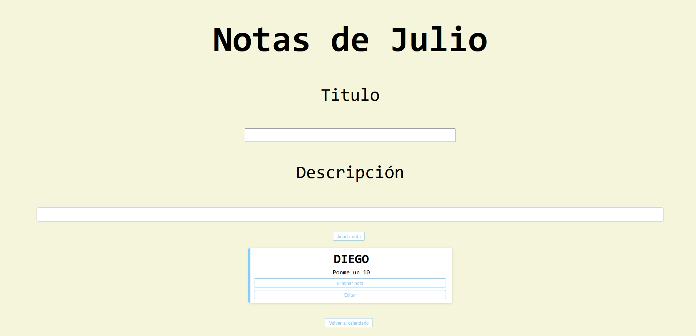
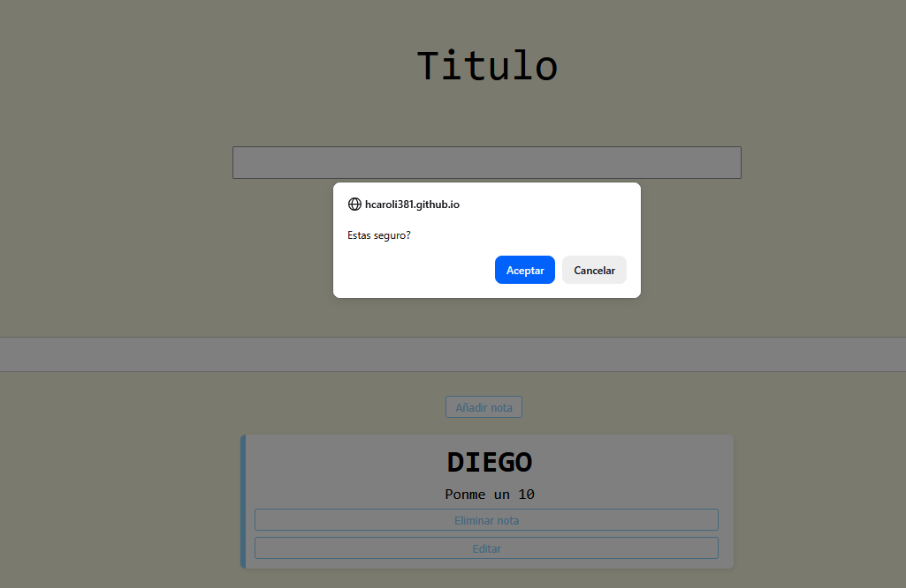
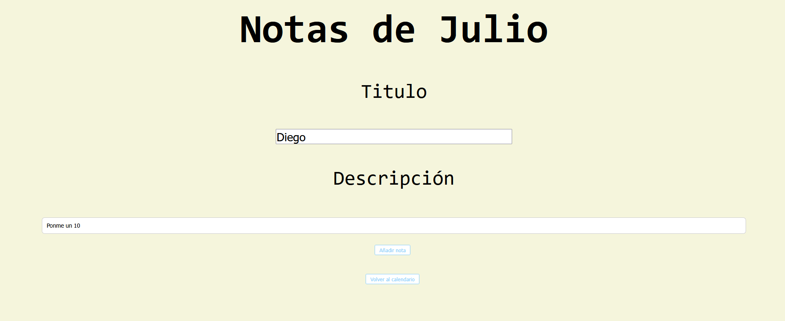
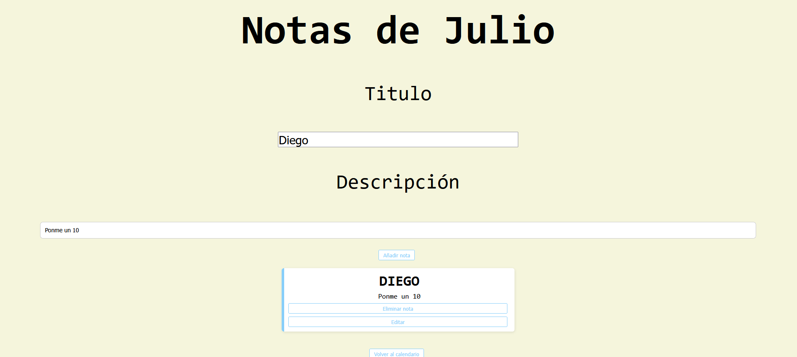

# CALENDARIO DE NOTAS
El proyecto consiste en un calendario al que le podremos poner una serie de notas con su titulo y descripcion según el mes.

## Página principal
Este es el index.html que nos muestra todos los meses, cuando uno de ellos tenga notas se pondrá de color anaranjado.

Los botones de listar notas nos mostrará todas juntas sin importar el mes.

Limpiar calendario borrará *TODAS* las notas.

## Mes individual
Este es el mes.html, en un solo html tenemos distinta información según el mes que cliquemos. El titulo será "notas de ..." según el mes, y las notas listadas solo se muestran en el mes que hemos elegido. 

Boton de añadir nota solo lo hará si hemos puesto *minimo* 2 caracteres tanto en el titulo como en la descripción.
Al aparecer una nota junto a ellalo harán dos botones,de borrar y editar.
Borrar nos pedirá una *confirmación*

Editar nos mandará de nuevo a titulo y descripción con los valores de la nota ya introducidos, si refrescamos sin cambiar la nota aparecerá de nuevo como si nada.

Volver al calendario nos mandará de nuevo a la pagina principal.

